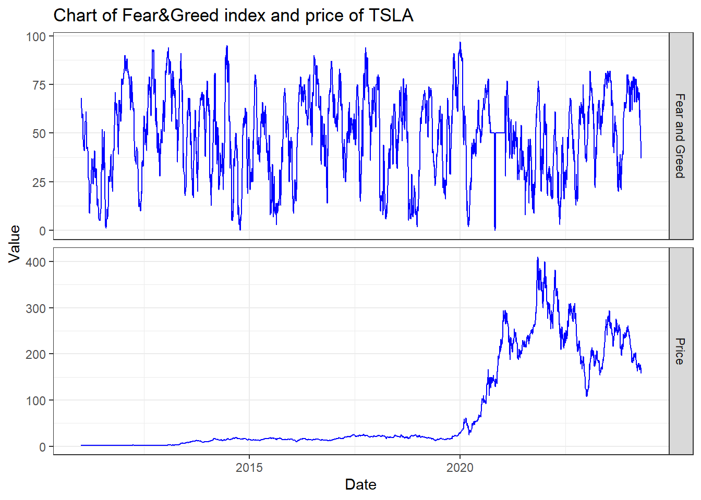
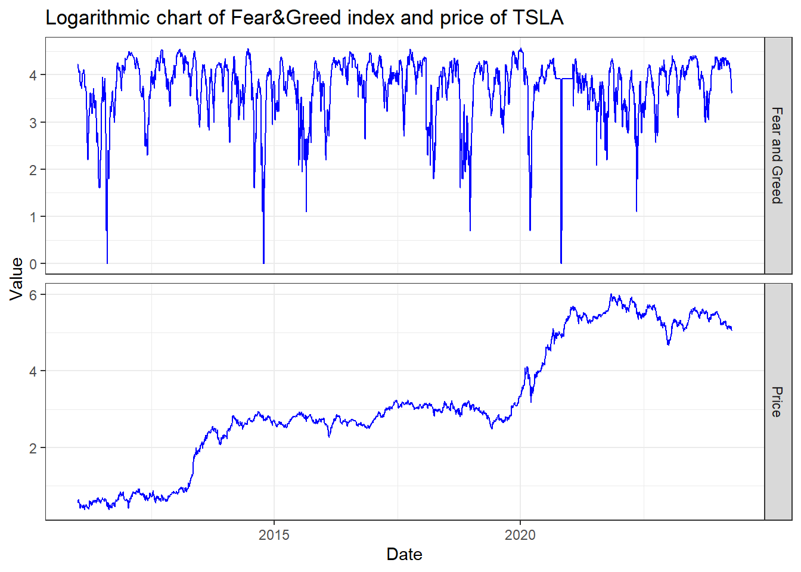
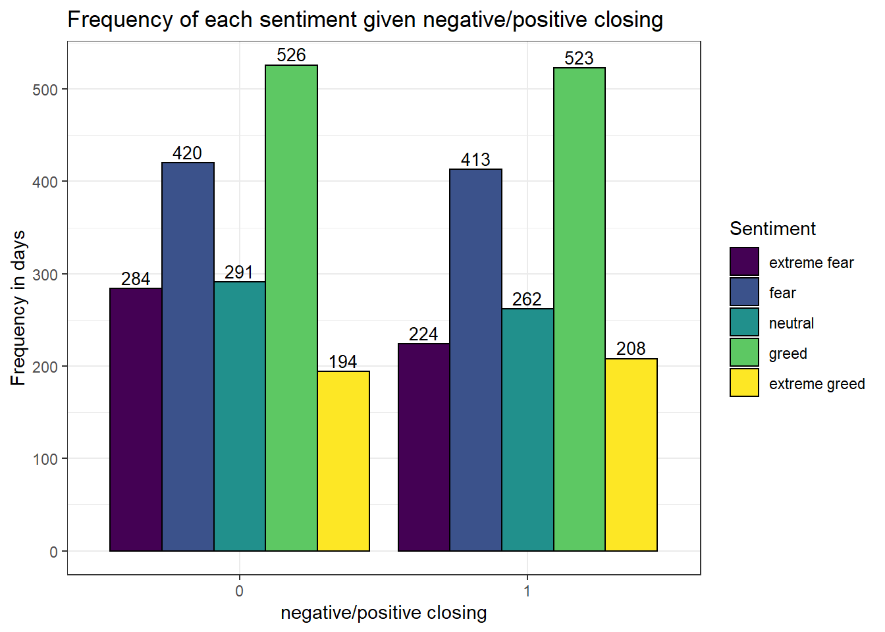

<!-- README.md is generated from README.Rmd. Please edit that file -->

# Thema: Fear&Greed index vs. daily return project

<!-- badges: start -->
<!-- badges: end -->

**Zentrale Fragestellung des Projekts ist:** Wie verhält sich der
Fear&Greed Index zu täglichen Renditen eines Asset  
(z.B. einer Aktie, einem Index oder auch einer Commodity)?

Klassische Faktoren die den Preis eines Asset beeinflussen sind zum
Beispiel:  
\* Fundamentale Daten (Unternehmensgewinne, Umsatz, Schulden,
Branchenentwicklungen, Unternehmensprognosen, etc.)  
\* Makroökonomische Faktoren: (Zinsen, Inflation, Arbeitslosigkeit,
Wirtschaftswachstum, etc.)  
\* Politische Entwicklungen: (Steuergesetze, Handelspolitik, Krieg und
Unruhen, etc.)  
Aber wie der berühmte Investor Warren Buffett einmal sagte: “Be fearful
when others are greedy, and greedy when others are fearful.”, spielt die
Psychologie auch eine wichtige Rolle an der Börse und genau hier setzt
mein Projekt an.

**Was ist der Fear&Greed Index?** Der Fear&Greed Index ist ein Indikator
von CNN (<https://edition.cnn.com/markets/fear-and-greed>), welcher der
Theorie nach, die emotionale Marktstimmung wiedergibt. Er wird anhand
einer Kombination von sieben Indikatoren berechnet, u.a. Volatilität,
Momentum und Put/Call-Ratio. Der Index reicht von 0 bis 100, wobei ein
Wert von 0 extreme Angst und ein Wert von 100 extreme Gier anzeigt. Die
Logik vom Indikator ist, dass übermäßige Angst die Aktienkurse
tendenziell nach unten treibt, während zu viel Gier eher das Gegenteil
bewirkt. Dieses Wissen kann dann im Investment Case einfließen.

Ab dem Jahr 2021 ist “meme stock” ein geläufiger Begriff. Woraus besteht
der Trend? Mit meme stocks werden Aktien bezeichnet, die durch Social
Media viral gehen und sich daraus massive Kursbewegungen ergeben,
unabhängig davon ob das Unternehmen nach “klassischen”
Bewertungsmethoden ein buy oder sell wäre. Viele bezeichnen die Aktie
des Elektroautoherstellers Tesla als meme stock. Gründe hierfür sind zum
Beispiel: eine unbegründete sehr hohe Bewertung, eine hohe Volatilität
und ein Geschäftsführer des sich selber als “Lorde Edge” bezeichnet.

Der Idee nach, müsste es also eine Abhängigkeit zwischen den Renditen
von Tesla und dem Marktsentiment geben. Im folgenden werde ich mein
Package am Beispiel der Tesla Aktie (Tickersymbol: TSLA) vorstellen.

## Installation

Das Package kann man folgendermaßen installieren:

``` r
# install.packages("remotes")
library(remotes)
remotes::install_gitlab("00000000014A5469/fg_vs_dailyreturn_project",
                        host="gitlab.lrz.de", 
                        auth_token = "your auth token", 
                        force = TRUE)
#Das Package heißt project1, d.h.
library(project1) #ruft das Package auf
```

## Datensatz

**Erste Komponente - Fear&Greed Daten:** CNN zeigt auf der Website nur
fünf Werte (Sentiment für heute, gestern, vor einer Woche, einem Monat
und einem Jahr) an. Die historischen Daten werden von CNN nicht
hochgeladen. Aus diesem Grund musste ich mir eine Möglichkeit überlegen,
wie ich trotzdem an den Datensatz komme. Dafür habe ich mir die Struktur
der Website angesehen und festgestellt, dass die Daten durch eine
HTTP-Request
(<https://production.dataviz.cnn.io/index/fearandgreed/graphdata/2020-09-18>)
angefordert und dann als JSON zwischengespeichert werden. Die Daten
reichen bis zum 18.09.2020 zurück. Das sind etwas wenig Beobachtungen.
Folglich habe ich auf github geschaut und einen csv Datensatz
(<https://github.com/hackingthemarkets/sentiment-fear-and-greed>)
gefunden, welcher bis ins Jahr 03.01.2011 zurückreicht. Diese zwei
Datensätze habe überschneidungsfrei zusammengefügt und jedem Tag ein
Sentiment (extreme fear, fear, neutral, greed oder extreme greed)
zugeordnet, weil beide Datensätze nur den numerischen Wert hatten.

**Zweite Komponente - Kursdaten:** Für die Kursdaten habe ich das
Package “tidyquant” verwendet. Mit der Funktion “tq_get()” konnte ich,
unter Angabe des Tickersymbols, historische Kursdaten von Yahoo Finance
(<https://finance.yahoo.com/>) herunterladen. Zusätzlich habe ich eine
weitere Spalte erstellt, die anhand des täglichen Schlusskurses anzeigt,
ob der Tag negativ (0) oder positiv (1) geschlossen hat.

Schließlich habe ich die Fear&Greed und Kursdaten in ein Dataframe
zusammengeführt. Dieses Dataframe enthält das Datum, den numerischen
Fear&Greed Wert, das “wörtliche” Sentiment und die Information, ob es
ein positiver oder negativer Tag war.

``` r
library(project1)
head(download_data(), n=10)
#>          Date Fear.Greed Sentiment Close
#> 1  2011-01-03         68     greed     0
#> 2  2011-01-04         68     greed     0
#> 3  2011-01-05         67     greed     1
#> 4  2011-01-06         64     greed     1
#> 5  2011-01-07         63     greed     1
#> 6  2011-01-10         58     greed     1
#> 7  2011-01-11         58     greed     0
#> 8  2011-01-12         58     greed     0
#> 9  2011-01-13         58     greed     0
#> 10 2011-01-14         60     greed     0
```

## Überblick

Das Package enthält vier Funktionen:

-   `download_data()` lädt Daten herunter und gibt einen Dataframe
    zurück.
-   `num_summary()` erstellt eine numerische Zusammenfassung in der
    Konsole.
-   `test_data()` testet den Datensatz auf Unabhängigkeit mit dem
    Chi-Square Test.
-   `visualize_data()` erstellt alle Grafiken zum zugehörigen Datensatz.

Alle Funktionen haben standardmäßig als Parameter, die Tesla Aktie und
ein Beobachtungsintervall von 03.01.2011 bis dem heutigen Datum. Diese
Parameter lassen sich individuell anpassen. Bei der Test Funktion gibt
es einen weiteren Parameter “visuals”. Standardmäßig ist er auf FALSE
gesetzt, das heißt es wird nur das Testergebnis ausgegeben, aber kein
Plot der Verteilung angezeigt.

Wichtige Bemerkung: das Datum hat das Format YYYY-MM-DD

## Explorative Analyse

Fahren wir nun fort mit der Analyse des Datensatzes. Als erstes erstelle
ich eine numerische Zusammenfassung:

``` r
library(project1)
num_summary()
#> [1] "Time horizont"
#> [1] "2011-01-03 to 2023-02-09"
#> [1] "Total amount of observations (cleaned)"
#> [1] 3045
#> [1] "Summary of the ticker price data"
#>    Min. 1st Qu.  Median    Mean 3rd Qu.    Max. 
#>   1.455  11.684  16.670  62.008  34.276 409.970 
#> [1] "Procentual change over given time"
#> [1] "11342.41%"
#> [1] "Frequency of each Sentiment over given time"
#> 
#>  extreme fear extreme greed          fear         greed       neutral 
#>           494           328           784           919           520 
#> [1] "Frequency of negative(0) and positive(1) closed days over given time"
#> 
#>    0    1 
#> 1569 1476 
#> [1] "Frequency of negative(0) and positive(1) closed days in regard of sentiment over given time"
#>                
#>                   0   1
#>   extreme fear  275 219
#>   extreme greed 160 168
#>   fear          397 387
#>   greed         462 457
#>   neutral       275 245
```

In den Test fließen mehr 3000 Beobachtungen ein. Dabei wurden im
Datensatz z.B. Feiertage und Wochenenden entfernt. “Summary of the
ticker price data” gibt an wie sich die Tesla Aktie über die Zeit
entwickelt hat. Die Aktie hatte ihre Tiefpunkt bei 1,45 USD und
Hochpunkt bei 409 USD. Der Durchschnittspreis beträgt 62 USD. Hätte man
am 03.01.2011 eine Tesla Aktie gekauft, könnte man sich jetz über einen
Wertzuwachs von ca. 11342% freuen. Insgesamt gab es mehr negative (1569)
als positive (1476) Tage, was einem Verhältnis von ca. 52:48 entspricht.
Betrachtet man das Sentiment, fällt auf dass die Marktteilnehmer am
häufigsten gierig waren (919), während extreme Gier am seltensten vorkam
(328). Dies trifft auch zu, wenn man das Sentiment in negative/positive
aufteilt.

``` r
library(project1)
visualize_data()
```



## Induktive Analyse

In diesem Abschnitt untersuchen wir, ob die zwei Variablen unabhängig
sind. Hierfür wird, unter der Annahme der Unabhängigkeit, der Chi-Square
Test verwendent. Wir erhalten einen Chi-Square Wert von ca. 5.59,
welcher zusammen mit dem Freiheitsgrad von vier, einem p-Wert von ca.
0.23 entspricht. 0.23 \> 0.05, d.h. H0 kann nicht verworfen werden.

Die Grafik “Simulation-Based and Theoretical Chi-Square Null
Distributions” zeigt als schwarzen Graph die theoretische Chi-Square
Verteilung mit Freiheitsgrad vier an, als Balkendiagramm die, mit dem
Bootstrap Verfahren, approximierte Chi-Square Verteilung und rot
markiert, den beobachteten Chi-Square Wert.

Aus diesem Test lässt sich folgern, dass die zwei Variablen stochastisch
unabhängig sind und es keinen Zusammenhang zwischen dem Fear&Greed Index
und den täglichen Renditen von der Tesla Aktie gibt. Das obige Zitat
trifft auf Tesla also nicht zu.

**Warnung:** Es ist wichtig zu bedenken, dass dieser Test nur eine (im
konkreten Fall keine) Korrelation zwischen den beiden Variablen
aufzeigt, sie impliziert keine Kausalität. Außerdem ist es wichtig
anzumerken, dass es andere Faktoren (wie oben genannt) gibt, die sowohl
abhängige als auch unabhängige Variablen beeinflussen können.

``` r
library(project1)
test_data(visuals = TRUE)
```


    #> 
    #>  Pearson's Chi-squared test
    #> 
    #> data:  table(df_fg$Sentiment, df_fg$Close)
    #> X-squared = 5.5936, df = 4, p-value = 0.2316
    #> 
    #> [1] "According to the Chi-Square test, one get a p-value of 0.232 which is bigger than the significance level of 0.05.\n                One cannot reject the null-hypothesis, which means that those variables are stochastically independent and there is\n                no relationship between the Fear&Greed sentiment and the daily closings."

## Beispiele

Bei der Wahl eines Beispiels habe ich mir verschiedene Tickersymbole
angesehen. Es folgen ein paar interessante Beobachtungen.

**1) SP500 Index (500 der größten börsennotierten US-amerikanischen
Unternehmen)** Hier fällt auf, dass man einen sehr kleinen p-Wert erhält
und somit folgern kann, dass die zwei Variablen stochastisch abhängig
sind. Woran liegt das? Das liegt daran, dass der Fear&Greed Index u.a.
auf Basis der Volatilität und des Momentum des SP500 berechnet wird.

``` r
library(project1)
test_data("^GSPC",visuals = TRUE)
```


    #> 
    #>  Pearson's Chi-squared test
    #> 
    #> data:  table(df_fg$Sentiment, df_fg$Close)
    #> X-squared = 38.275, df = 4, p-value = 9.834e-08
    #> 
    #> [1] "According to the Chi-Square test, one get a p-value of 0 which is less than the significance level of 0.05.\n                One can reject the null-hypothesis, which means that those variables are stochastically dependent and there is\n                a relationship between the Fear&Greed sentiment and the daily closings."

**2) DAX40 (40 größten börsennotierten deutschen Unternehmen)** Hier
erhält man ebenfalls einen sehr kleinen p-Wert und somit lässt sich
folgern, dass die zwei Variablen stochastisch abhängig sind.

``` r
library(project1)
test_data("^GDAXI",visuals = TRUE)
```


    #> 
    #>  Pearson's Chi-squared test
    #> 
    #> data:  table(df_fg$Sentiment, df_fg$Close)
    #> X-squared = 26.601, df = 4, p-value = 2.393e-05
    #> 
    #> [1] "According to the Chi-Square test, one get a p-value of 0 which is less than the significance level of 0.05.\n                One can reject the null-hypothesis, which means that those variables are stochastically dependent and there is\n                a relationship between the Fear&Greed sentiment and the daily closings."

**3) Goldpreis** In diesem Fall erhält man einen p-Wert von über 0.84.
H0 kann nicht verworfen werden, d.h. es besteht stochastische
Unabhängigkeit.

``` r
library(project1)
test_data("GC=F",visuals = TRUE)
```


    #> 
    #>  Pearson's Chi-squared test
    #> 
    #> data:  table(df_fg$Sentiment, df_fg$Close)
    #> X-squared = 1.3798, df = 4, p-value = 0.8477
    #> 
    #> [1] "According to the Chi-Square test, one get a p-value of 0.848 which is bigger than the significance level of 0.05.\n                One cannot reject the null-hypothesis, which means that those variables are stochastically independent and there is\n                no relationship between the Fear&Greed sentiment and the daily closings."
