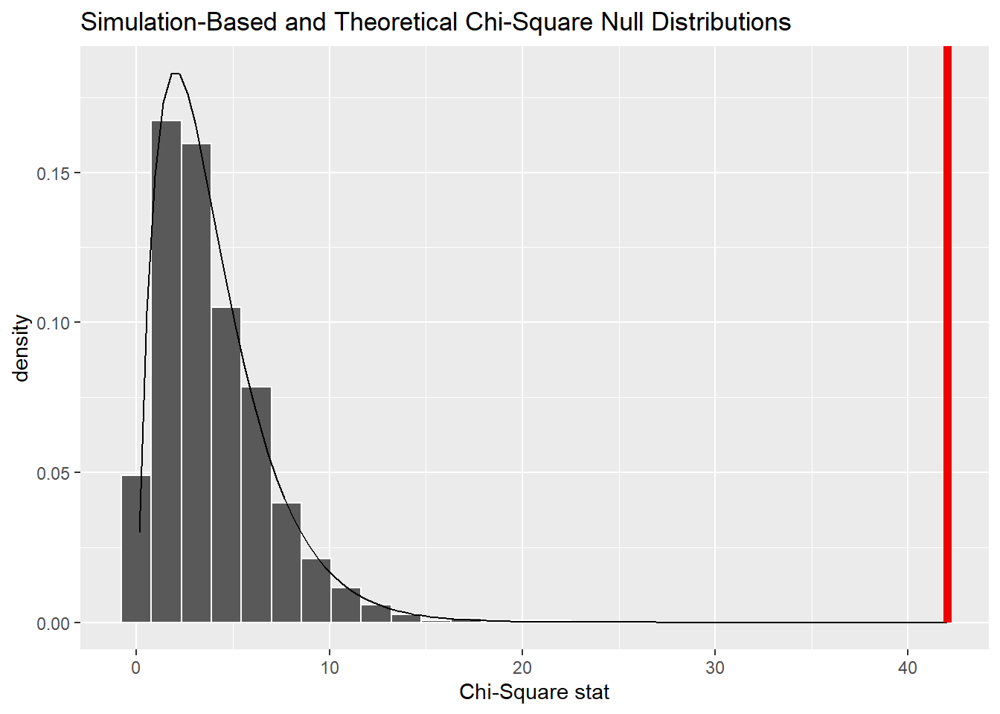
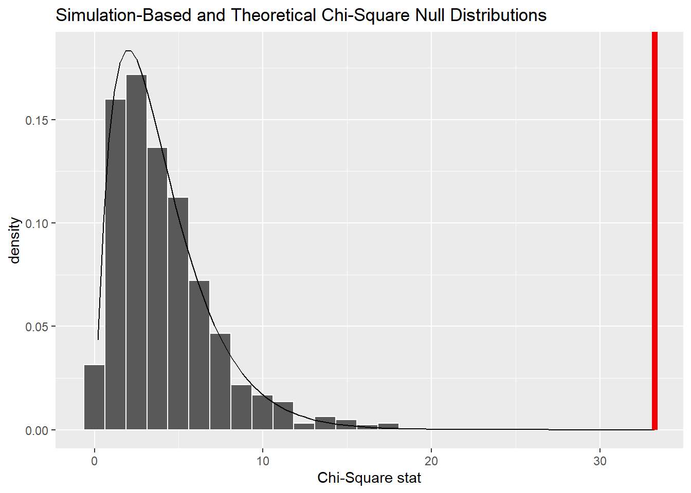
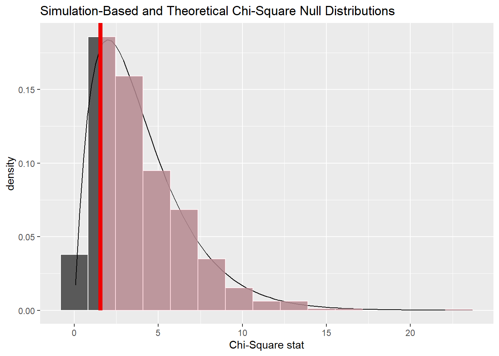

<!-- README.md is generated from README.Rmd. Please edit that file -->

# Topic: Fear&Greed index vs. daily return project

<!-- badges: start -->
<!-- badges: end -->

**The central question of the project is:** How does the Fear&Greed
Index relate to the daily returns of an asset (e.g. a stock, an index or
a commodity)?

Classic factors that influence the price of an asset are, for example

-   Fundamental data (company profits, sales, debt, industry
    developments, company forecasts, etc.).
-   Macroeconomic factors: (interest rates, inflation, unemployment,
    economic growth, etc.)
-   Political developments: (tax laws, trade policy, war and unrest,
    etc.)

But as the famous investor Warren Buffett once said: “Be fearful when
others are greedy, and greedy when others are fearful.”, psychology also
plays an important role in the stock market and this is exactly where my
project comes in.

**What is the Fear&Greed Index?** The Fear&Greed Index is an indicator
from CNN (<https://edition.cnn.com/markets/fear-and-greed>), which,
according to theory, reflects emotional market sentiment. It is
calculated using a combination of seven indicators, including
volatility, momentum and put/call ratio. The index ranges from 0 to 100,
with a value of 0 indicating extreme fear and a value of 100 indicating
extreme greed. The logic of the indicator is that excessive fear tends
to drive share prices down, while too much greed tends to have the
opposite effect. This knowledge can then be incorporated into the
investment case.

From 2021, “meme stock” is a common term. So why was it a trend? Meme
stocks are stocks that go viral on social media and result in massive
price movements, regardless of whether the company would be a buy or
sell according to “traditional” valuation methods. Some refer to the
stock of electric car manufacturer Tesla as a meme stock. The reasons
for this are, for example: an unreasonably high valuation, high
volatility and a CEO who describes himself as “Lorde Edge”.

According to my idea, there should therefore be a dependency between
Tesla’s returns and market sentiment. In the following, I will present
my package using the Tesla stock (ticker symbol: TSLA) as an example.

## Installation

The package can be installed as follows:

``` r
# install.packages("remotes")
library(remotes)
remotes::install_git(https://github.com/wasserhaus/fg_project.git)
#The package is called project1, i.e.
library(project1) #calls the package
```

## Data set

**First component - Fear&Greed data:** CNN only displays five values on
its website (sentiment for today, yesterday, a week ago, a month ago and
a year ago). The historical data is not uploaded by CNN. For this
reason, I had to think of a way how I could still access the data set.
To do this, I looked at the structure of the website and realised that
the data is requested via an HTTP request
(<https://production.dataviz.cnn.io/index/fearandgreed/graphdata/2020-09-18>)
and then cached as JSON. The data goes back to 18/09/2020. That’s a
little short on observations. Consequently, I looked on github and found
a csv dataset from @hackingthemarkets
(<https://github.com/hackingthemarkets/sentiment-fear-and-greed>) that
goes back to 03/01/2011. I merged these two datasets without overlap and
assigned each day a sentiment (extreme fear, fear, neutral, greed or
extreme greed) because both datasets only provided the numerical value.

**Second component - price data:** I used the “tidyquant” package for
the price data. Using the “tq_get()” function, I was able to download
historical price data from Yahoo Finance (<https://finance.yahoo.com/>),
specifying the ticker symbol. In addition, I created another column that
shows whether the day closed negative (0) or positive (1) based on the
daily closing price.

Finally, I merged the Fear&Greed and price data into a dataframe. This
dataframe contains the date, the numerical Fear&Greed value, the
“literal” sentiment and the information whether it was a positive or
negative day.

``` r
library(project1)
head(download_data(), n=10)
#>          Date Fear.Greed Sentiment Close
#> 1  2011-01-03         68     greed     0
#> 2  2011-01-04         68     greed     0
#> 3  2011-01-05         67     greed     1
#> 4  2011-01-06         64     greed     1
#> 5  2011-01-07         63     greed     1
#> 6  2011-01-10         58     greed     1
#> 7  2011-01-11         58     greed     0
#> 8  2011-01-12         58     greed     0
#> 9  2011-01-13         58     greed     0
#> 10 2011-01-14         60     greed     0
```

## Overview

The package contains four functions:

-   `download_data()` downloads data and returns a dataframe.

-   `num_summary()` creates a numerical summary in the terminal.

-   `test_data()` tests the data set for independence using the
    Chi-Square test.

-   `visualize_data()` creates all visuals for the associated data set.

All functions have the Tesla stock and an observation interval from 3
January 2011 to the current date as default parameters. These parameters
can be customised. The test function has an additional parameter
“visuals”. It is set to FALSE by default, which means that only the test
result is output, but no plot of the distribution is displayed.

Important remark: the date has the format YYYY-MM-DD

## Exploratory analysis

Let us now proceed to analyse the data set. First, I will create a
numerical summary:

``` r
library(project1)
num_summary()
#> [1] "Time horizont"
#> [1] "2011-01-03 to 2024-04-17"
#> [1] "Total amount of observations (cleaned)"
#> [1] 3345
#> [1] "Summary of the ticker price data"
#>    Min. 1st Qu.  Median    Mean 3rd Qu.    Max. 
#>   1.455  12.714  17.659  75.788 149.833 409.970 
#> [1] "Procentual change over given time"
#> [1] "8852.93%"
#> [1] "Frequency of each Sentiment over given time"
#> 
#>  extreme fear extreme greed          fear         greed       neutral 
#>           508           402           833          1049           553 
#> [1] "Frequency of negative(0) and positive(1) closed days over given time"
#> 
#>    0    1 
#> 1715 1630 
#> [1] "Frequency of negative(0) and positive(1) closed days in regard of sentiment over given time"
#>                
#>                   0   1
#>   extreme fear  284 224
#>   extreme greed 194 208
#>   fear          420 413
#>   greed         526 523
#>   neutral       291 262
```

The test includes more than 3000 observations. Public holidays and
weekends were removed from the data set. “Summary of the ticker price
data” shows how the Tesla stock has developed over time. The stock had
its low at USD 1.45 and high at USD 409. The average price is USD 62. If
you had bought a Tesla stock on 3 January 2011, you could now look
forward to an increase in value of approx. 9099%. Overall, there were
more negative (1715) than positive (1628) days, which corresponds to a
ratio of approx. 51:49. Looking at the sentiment, it is noticeable that
market participants were most often greedy (1049), while extreme greed
was the least common (402). This is also true when the sentiment is
split into negative/positive.

``` r
library(project1)
visualize_data()
```


## Inductive analysis

In this section, we analyse whether the two variables are independent.
For this purpose, assuming independence, the chi-square test is used. We
obtain a chi-square value of approx. 6.94, which, together with the
degree of freedom of four, corresponds to a p-value of approx. 0.14.
0.14 \> 0.05, i.e. H0 cannot be rejected.

The graph “Simulation-Based and Theoretical Chi-Square Null
Distributions” shows the theoretical Chi-Square distribution with a
degree of freedom of four as a black graph, the Chi-Square distribution
approximated using the bootstrap method as a bar chart and the observed
Chi-Square value marked in red.

From this test it can be concluded that the two variables are
stochastically independent and that there is no correlation between the
Fear&Greed Index and the daily returns of the Tesla stock. The above
quote therefore does not apply to Tesla.

**Warning:** It is important to keep in mind that this test only shows a
correlation (in this specific case, no correlation) between the two
variables, it does not imply causality. It is also important to note
that there are other factors (as mentioned above) that can influence
both dependent and independent variables.

``` r
library(project1)
test_data(visuals = TRUE)
```


    #> 
    #>  Pearson's Chi-squared test
    #> 
    #> data:  table(df_fg$Sentiment, df_fg$Close)
    #> X-squared = 7.007, df = 4, p-value = 0.1355
    #> 
    #> [1] "According to the Chi-Square test, one get a p-value of 0.136 which is bigger than the significance level of 0.05.\n                One cannot reject the null-hypothesis, which means that those variables are stochastically independent and there is\n                no relationship between the Fear&Greed sentiment and the daily closings."

## Further examples

I looked at various ticker symbols when choosing an example. Here are a
few interesting observations.

**1) S&P500 Index (500 of the largest listed US companies)** It is
noticeable here that we obtain a very small p-value and can therefore
conclude that the two variables are stochastically dependent. Why is
that? This is because the Fear&Greed Index is calculated on the basis of
the volatility and momentum of the SP500, among other things.

``` r
library(project1)
test_data("^GSPC",visuals = TRUE)
```



    #> 
    #>  Pearson's Chi-squared test
    #> 
    #> data:  table(df_fg$Sentiment, df_fg$Close)
    #> X-squared = 42.04, df = 4, p-value = 1.637e-08
    #> 
    #> [1] "According to the Chi-Square test, one get a p-value of 0 which is less than the significance level of 0.05.\n                One can reject the null-hypothesis, which means that those variables are stochastically dependent and there is\n                a relationship between the Fear&Greed sentiment and the daily closings."

**2) DAX40 (40 largest listed German companies)** This also gives a very
small p-value and it can therefore be concluded that the two variables
are stochastically dependent.

``` r
library(project1)
test_data("^GDAXI",visuals = TRUE)
```



    #> 
    #>  Pearson's Chi-squared test
    #> 
    #> data:  table(df_fg$Sentiment, df_fg$Close)
    #> X-squared = 33.236, df = 4, p-value = 1.069e-06
    #> 
    #> [1] "According to the Chi-Square test, one get a p-value of 0 which is less than the significance level of 0.05.\n                One can reject the null-hypothesis, which means that those variables are stochastically dependent and there is\n                a relationship between the Fear&Greed sentiment and the daily closings."

**3) Gold price** In this case, a p-value of over 0.82 is obtained. H0
cannot be rejected, i.e. there is stochastic independence.

``` r
library(project1)
test_data("GC=F",visuals = TRUE)
```



    #> 
    #>  Pearson's Chi-squared test
    #> 
    #> data:  table(df_fg$Sentiment, df_fg$Close)
    #> X-squared = 1.541, df = 4, p-value = 0.8194
    #> 
    #> [1] "According to the Chi-Square test, one get a p-value of 0.819 which is bigger than the significance level of 0.05.\n                One cannot reject the null-hypothesis, which means that those variables are stochastically independent and there is\n                no relationship between the Fear&Greed sentiment and the daily closings."
